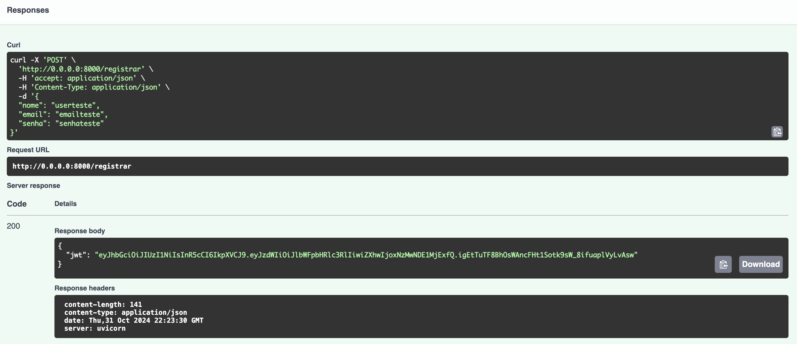
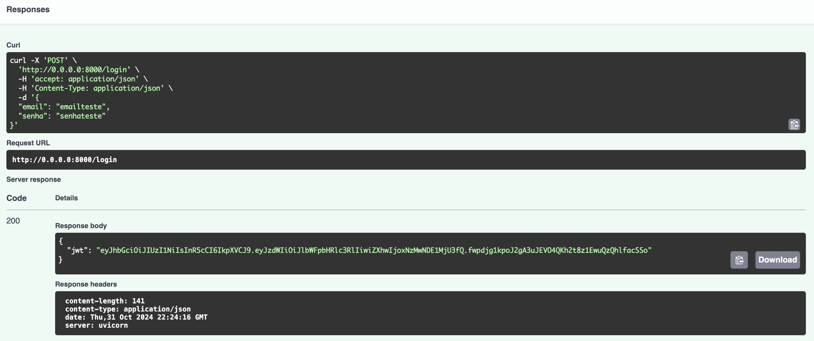
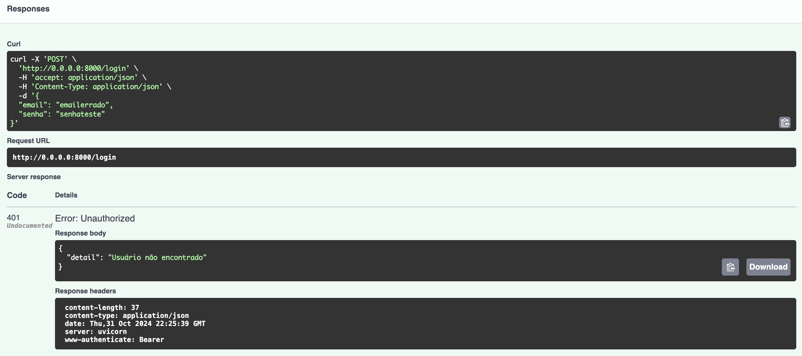
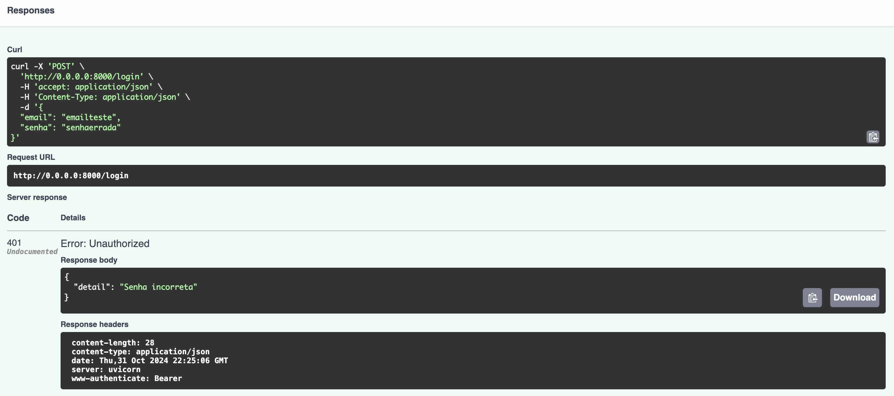
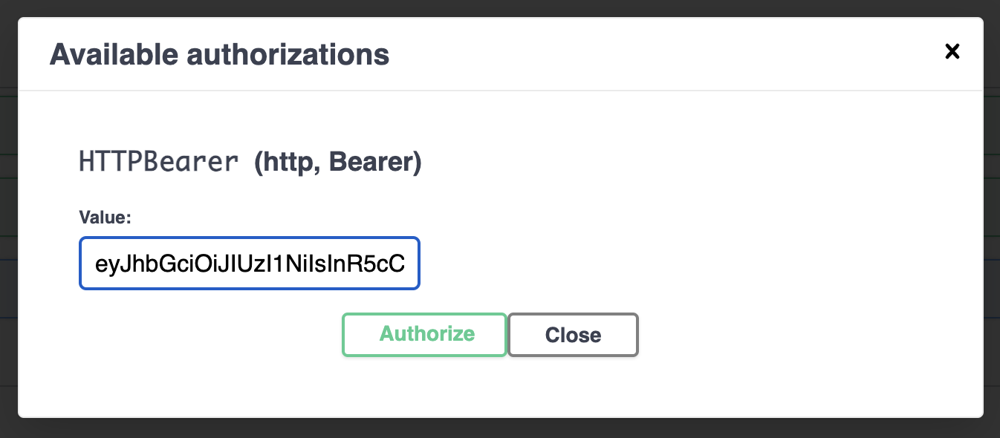
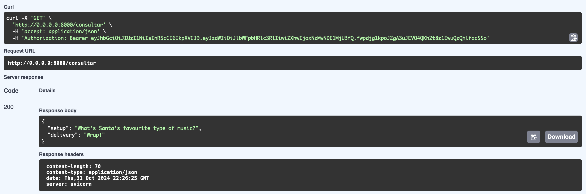
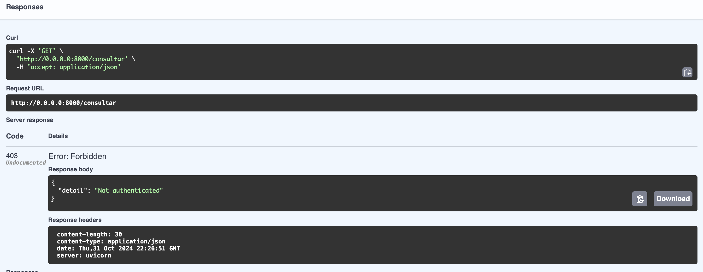

# Prints dos testes da API

Os prints dos testes da API foram feitos utilizando a documentação criada pela própria FastAPI no Swagger.

### POST /register

### POST /login - sem erro

### POST /login - com email errado

### POST /login - com senha errada

### Autenticação no Swagger

### GET /consultar - sem erro

### GET /consultar - sem token no header

